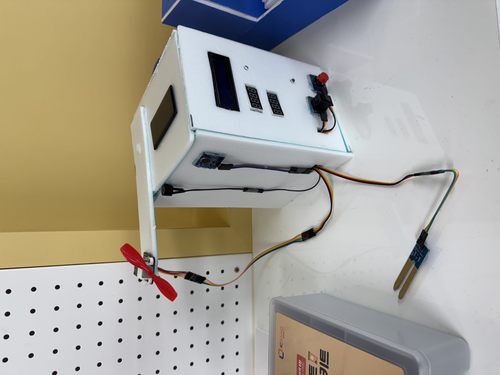

# 🌱 프로젝트 아이디어 No.47 - PlantClock (식물 타이머)
- 2025 선후배와 함꼐하는 코딩 페스티벌 피지컬 컴퓨팅 분야
  
> **여러 명이 함께 키우는 학급 식물을 위한 급수 기록 & 자동 알림 스마트 화분 프로젝트**

---

## 프로젝트 개요

- **주제 :** 나의 삶을 편리하게 해주는 피지컬 컴퓨팅(불편함 해결, 문제 해결 등)
- **목적 :** 여러 명이 하나의 식물을 키울 때 발생하는 **중복 급수 문제**를 해결
- **핵심 기능 :** 급수 시간 기록, 경과 시간 표시, 실시간 토양 습도/환경 정보, 자동 급수 알림

---

## 주요 기능

- 편의상 현재 시간을 분 : 초로 표현함
- **LCD** : 현재 시간(분 : 초), 토양 습도 실시간 표시
- **7세그먼트 4자리 FND(2개)** :  
  - FND1 : 마지막 급수 시각  
  - FND2 : 마지막 급수 이후 경과 시간
- **급수 알림** : 경과 30초(30분) 이상이면  
  - 파란 LED 깜빡임  
  - 진동 모터 동작  
  - 부저 울림
- **급수 버튼** : 누르면 현재 시각으로 기록 & 경과시간 리셋 & 알림 OFF
- **레버 스위치** : 선풍기 ON/OFF
- **RGB LED** : 팬 동작 여부 시각적 알림(초록 : ON, 빨강 : OFF)
- **태양광 모듈** : 전력 보조(장식)

---

## 부품 목록

- **Arduino Uno** + 고릴라셀
- **TM1637 7-segment 4digit FND** ×2
- **16x2 I2C LCD (0x20)**
- **토양 습도 센서**
- **버튼**
- **스위치**
- **진동 모터 (D3)**
- **Blue LED (D4, 급수 알림용)**
- **RGB LED (D9, D10, D11, 팬 상태)**
- **팬 모터 + 드라이버 (A2, A3)**
- **부저 (A1)**
- **태양광 모듈**
- **점퍼선, 브레드보드 등**

---

## 회로 연결도 (핀맵)

| 핀  | 연결 부품/기능             |
|-----|---------------------------|
| D2  | 급수 버튼                 |
| D3  | 진동 모터                 |
| D4  | 알림 LED                  |
| D5  | FND1 (DIO, 급수 시각)     |
| D6  | FND1 (CLK, 급수 시각)     |
| D7  | FND2 (DIO, 경과 시간)     |
| D8  | FND2 (CLK, 경과 시간)     |
| D9  | RGB LED (파랑)            |
| D10 | RGB LED (초록)            |
| D11 | RGB LED (빨강)            |
| D12 | 레버 스위치(팬 제어)      |
| A0  | 토양 습도 센서            |
| A1  | 부저                      |
| A2  | 팬 드라이버 INA           |
| A3  | 팬 드라이버 INB           |
| A4  | I2C SDA (LCD/RTC)         |
| A5  | I2C SCL (LCD/RTC)         |

---

## 코드 구조

- `main.ino` : 전체 제어 코드(센서, 알림, 디스플레이, 팬, 알람 등 통합)
- `README.md` : 프로젝트 개요 및 설명

---

## 발전
- 화분에 제품 내장
- 블루투스 연동
- 태양광 충전
- 물 감지 센서와 습도 센서로 물 감지 후, 서브 모터를 통해 호스를 열어서 자동 급수 -> 수동 & 자동 급수 모두 가능하게

